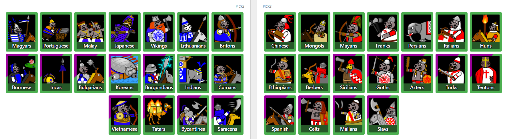

<style>
 img { width: 100%; }
 pre.highlight > button {
     opacity: 0;
 }
 pre.highlight:hover > button {
  opacity: 1;
}

pre.highlight > button:active,
pre.highlight > button:focus {
  opacity: 1;
}
</style>

## Welcome to the Civpick-UI-Project
Created to enjoy an unique look of [civilization drafts](https://aoe2cm.net) on [Nili's](https://twitch.tv/nili_aoe) streams.

|  |
|:--:|
| How a draft could look like |

Drawings were made and owned by [AgniousPrime](https://twitch.tv/agniousprime).
Code was written by SyntacticSalt (or SyntacticSugar, who knows -- contact on discord SyntacticSugar#1829).

## Installation Instructions and Requirements

### In the browser
 Currently, only Chrome/Chromium is tested and supported.
Firefox might work as well.

1. Install [Tampermonkey](https://www.tampermonkey.net/), a browser addon to support userscripts.
2. [Click here to install the script](assets/src/aoe2cm_civ_replacement_TM.user.js).
3. Accept installation when asked by Tampermonkey.
4. You are done! Enjoy a hippo-themed civ draft.

### In OBS
1. Create a "Browser Source" in OBS with the link to the draft
2. Copy the following CSS into the *Custom CSS* section in the source settings.


```css

```